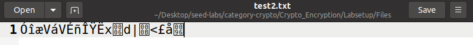

# LOGBOOK10 - Secret Key Encryption
# Task 1: Frequency Analysis

<div <div align="justify">
<p> Para esta tarefa, inicialmente corremos o script de python que nos permite verificar o número de ocorrências de cada letra ou combinaçoes de letras, no ficheiro de texto. </p>

```Bash
[11/26/23]seed@VM:~/.../Files$ python3 freq.py 
-------------------------------------
1-gram (top 20):
n: 488
y: 373
v: 348
x: 291
u: 280
q: 276
m: 264
h: 235
t: 183
i: 166
p: 156
a: 116
c: 104
z: 95
l: 90
g: 83
b: 83
r: 82
e: 76
d: 59
-------------------------------------
2-gram (top 20):
yt: 115
tn: 89
mu: 74
nh: 58
vh: 57
hn: 57
vu: 56
nq: 53
xu: 52
up: 46
xh: 45
yn: 44
np: 44
vy: 44
nu: 42
qy: 39
vq: 33
vi: 32
gn: 32
av: 31
-------------------------------------
3-gram (top 20):
ytn: 78
vup: 30
mur: 20
ynh: 18
xzy: 16
mxu: 14
gnq: 14
ytv: 13
nqy: 13
vii: 13
bxh: 13
lvq: 12
nuy: 12
vyn: 12
uvy: 11
lmu: 11
nvh: 11
cmu: 11
tmq: 10
vhp: 10

```

<p> Apartir daqui, tivemos que analisar estes resultados e o texto fornecido, de forma a tentar perceber qual a chave utilizada para encriptar o texto. Conseguimos então perceber facilmente que o 3-gram mais frequente era 'ytn' e correspondia a 'the'. Percebemos também que o 3-gram 'vup' correspondia a 'and'. Apartir dai, após várias tentativas, conseguimos perceber que a chave utilizada era 'THEANDKSUYROCWGFMBILPVXQJZ' e, utilizando o comando 'tr 'ytnvupsqzdhxalrbcgmiefkjow' 'THEANDKSUYROCWGFMBILPVXQJZ' < ciphertext.txt > result.txt', alteramos o texto para: </p>

<p>
THE OSCARS TURN  ON SUNDAY WHICH SEEMS ABOUT RIGHT AFTER THIS LONG STRANGE AWARDS TRIP THE BAGGER FEELS LIKE A NONAGENARIAN TOO

THE AWARDS RACE WAS BOOKENDED BY THE DEMISE OF HARVEY WEINSTEIN AT ITS OUTSET AND THE APPARENT IMPLOSION OF HIS FILM COMPANY AT THE END AND IT WAS SHAPED BY THE EMERGENCE OF METOO TIMES UP BLACKGOWN POLITICS ARMCANDY ACTIVISM AND A NATIONAL CONVERSATION AS BRIEF AND MAD AS A FEVER DREAM ABOUT WHETHER THERE OUGHT TO BE A PRESIDENT WINFREY THE SEASON DIDNT JUST SEEM EXTRA LONG IT WAS EXTRA LONG BECAUSE THE OSCARS WERE MOVED TO THE FIRST WEEKEND IN MARCH TO AVOID CONFLICTING WITH THE CLOSING CEREMONY OF THE WINTER OLYMPICS THANKS PYEONGCHANG

ONE BIG QUESTION SURROUNDING THIS YEARS ACADEMY AWARDS IS HOW OR IF THE CEREMONY WILL ADDRESS METOO ESPECIALLY AFTER THE GOLDEN GLOBES WHICH BECAME A JUBILANT COMINGOUT PARTY FOR TIMES UP THE MOVEMENT SPEARHEADED BY POWERFUL HOLLYWOOD WOMEN WHO HELPED RAISE MILLIONS OF DOLLARS TO FIGHT SEXUAL HARASSMENT AROUND THE COUNTRY

SIGNALING THEIR SUPPORT GOLDEN GLOBES ATTENDEES SWATHED THEMSELVES IN BLACK SPORTED LAPEL PINS AND SOUNDED OFF ABOUT SEXIST POWER IMBALANCES FROM THE RED CARPET AND THE STAGE ON THE AIR E WAS CALLED OUT ABOUT PAY INEQUITY AFTER ITS FORMER ANCHOR CATT SADLER QUIT ONCE SHE LEARNED THAT SHE WAS MAKING FAR LESS THAN A MALE COHOST AND DURING THE CEREMONY NATALIE PORTMAN TOOK A BLUNT AND SATISFYING DIG AT THE ALLMALE ROSTER OF NOMINATED DIRECTORS HOW COULD THAT BE TOPPED

AS IT TURNS OUT AT LEAST IN TERMS OF THE OSCARS IT PROBABLY WONT BE WOMEN INVOLVED IN TIMES UP SAID THAT ALTHOUGH THE GLOBES SIGNIFIED THE INITIATIVES LAUNCH THEY NEVER INTENDED IT TO BE JUST AN AWARDS SEASON CAMPAIGN OR ONE THAT BECAME ASSOCIATED ONLY WITH REDCARPET ACTIONS INSTEAD A SPOKESWOMAN SAID THE GROUP IS WORKING BEHIND CLOSED DOORS AND HAS SINCE AMASSED  MILLION FOR ITS LEGAL DEFENSE FUND WHICH AFTER THE GLOBES WAS FLOODED WITH THOUSANDS OF DONATIONS OF  OR LESS FROM PEOPLE IN SOME COUNTRIES

NO CALL TO WEAR BLACK GOWNS WENT OUT IN ADVANCE OF THE OSCARS THOUGH THE MOVEMENT WILL ALMOST CERTAINLY BE REFERENCED BEFORE AND DURING THE CEREMONY  ESPECIALLY SINCE VOCAL METOO SUPPORTERS LIKE ASHLEY JUDD LAURA DERN AND NICOLE KIDMAN ARE SCHEDULED PRESENTERS

ANOTHER FEATURE OF THIS SEASON NO ONE REALLY KNOWS WHO IS GOING TO WIN BEST PICTURE ARGUABLY THIS HAPPENS A LOT OF THE TIME INARGUABLY THE NAILBITER NARRATIVE ONLY SERVES THE AWARDS HYPE MACHINE BUT OFTEN THE PEOPLE FORECASTING THE RACE SOCALLED OSCAROLOGISTS CAN MAKE ONLY EDUCATED GUESSES

THE WAY THE ACADEMY TABULATES THE BIG WINNER DOESNT HELP IN EVERY OTHER CATEGORY THE NOMINEE WITH THE MOST VOTES WINS BUT IN THE BEST PICTURE CATEGORY VOTERS ARE ASKED TO LIST THEIR TOP MOVIES IN PREFERENTIAL ORDER IF A MOVIE GETS MORE THAN  PERCENT OF THE FIRSTPLACE VOTES IT WINS WHEN NO MOVIE MANAGES THAT THE ONE WITH THE FEWEST FIRSTPLACE VOTES IS ELIMINATED AND ITS VOTES ARE REDISTRIBUTED TO THE MOVIES THAT GARNERED THE ELIMINATED BALLOTS SECONDPLACE VOTES AND THIS CONTINUES UNTIL A WINNER EMERGES
... </p>

# Task 2: Encryption using Different Ciphers and Modes
<p>
Para esta tarefa, utilizamos três modos de encriptação diferentes: -aes-128-cbc, -bf-cbc e -aes-128-cfb.</p>

<p> De modo a conseguirmos testar, criamos um ficheiro de teste com o seguinte conteúdo: </p>

```Bash
[11/26/23]seed@VM:~/.../Files$ cat test.txt
This is a test file
```

<p> Assim, utilizando o comando 'openssl enc -ciphertype -e -in test.txt -out test2.txt -K 00112233445566778889aabbccddeeff -iv 0102030405060708', e alterando o -ciphertype, obtivemos os seguintes resultados: </p>

- -aes-128-cbc


- -bf-cbc


- -aes-128-cfb
  



# Task 3: Encryption Mode – ECB vs. CBC

<p> Para esta tarefa, é nos pedido para encriptar uma imagem utilizando os modos ECB e CBC. A imagem original é a seguinte: </p>


- ECB:
<p> De forma a encriptar a imagem utilizando o modo ECB, utilizamos o comando 'openssl enc -aes-128-ecb -e -in pic_original.bmp -out pic_ecb.bmp -K 00112233445566778889aabbccddeeff'. O resultado obtido foi o seguinte: </p>


- CBC:
<p> De forma a encriptar a imagem utilizando o modo CBC, utilizamos o comando 'openssl enc -aes-128-cbc -e -in pic_original.bmp -out pic_cbc.bmp -K 00112233445566778889aabbccddeeff -iv 0102030405060708'. O resultado obtido foi o seguinte: </p>


<p> Ao usar o modo CBC, a imagem fica visualmente distorcida e não é possível identificar o seu conteúdo. No entanto, com o modo ECB, ainda é possível reconhecer a imagem, embora com menos detalhes e cores corretas.

Isso acontece porque o ECB divide o ficheiro em blocos de bytes de tamanho fixo e encripta os separadamente. Como a mesma chave é usada para cada bloco e eles são independentes, certos padrões começam a aparecer no ficheiro encriptado, o que pode mostrar semelhanças com o ficheiro original.

Já o modo CBC usa um vetor de inicialização e realiza um XOR nos blocos de dados antes de se realizar a encriptação. Os dados encriptados são usados como vetor de inicialização para o próximo bloco, que também é XORed. Esse processo continua até o final do ficheiro. Isso cria uma cadeia de encriptação em que cada bloco encriptado é completamente diferente do anterior, mesmo que represente o mesmo padrão de dados. Como resultado, o ficheiro final fica completamente irreconhecível, como visto nas imagens anteriores. </p>

# LOGBOOK10 - CTF

> cipherspec.py:
<p>
O problema encontra se na função 'gen', função que gera a chave. Esta é composta por 13 bytes nulos (0x00) seguidos por 3 bytes aleatórios. Isto é um problema de segurança, pois reduz significativamente a quantidade de chaves possíveis. Em vez de ter que adivinhar uma chave de 16 bytes (128 bits), um atacante só precisa adivinhar os últimos 3 bytes (24 bits), o que é muito mais fácil.
</p>

> Como consigo usar esta ciphersuite para cifrar e decifrar dados?
<p>
Podemos utilizar a ciphersuite utilizando a função enc para encriptar uma mensagem e a função dec para decifrar uma mensagem.
</p>

> Como consigo fazer uso da vulnerabilidade que observei para quebrar o código?
<p>
Para quebrar o código, podemos tentar de forma bruta gerar todas as chaves possíveis e verificar se alguma delas decifra a mensagem e decifrar utilizando a função dec.
</p>

> Como consigo automatizar este processo, para que o meu ataque saiba que encontrou a flag?
<p>
Podemos automatizar o processo utilizando um script de python que gera todas as chaves possíveis e verifica se alguma delas decifra a mensagem. Se alguma mensagem decifrada começar por 'flag{', então essa é impressa no ecrã.
</p>

> Encontrar a flag:

<p> 
Primeiramente entrando no servidor com o comando 'nc ctf-fsi.fe.up.pt 6003', é nos fornecido o nonce e a mensagem encriptada. </p>

- nonce: da6074da3b9243a4cc7799bd1695a6e3
- ciphertext: f525c6710088f0e247d3e7a6d4258955fe502e0c797ce8513c1fd193878a1974af596984365b9b


<p>
A partir dai, criamos um script de python 'help.py', que tem como objetivo gerar todas as chaves possíveis e verificar se alguma delas decifra a mensagem.
</p>

```python
from cipherspec import dec, KEYLEN
import os
import binascii

# Define a function to check if a decrypted message is the flag
def is_successful(msg):
    try:
        # Try to decode the message as ASCII
        msg_str = msg.decode('ascii')
    except UnicodeDecodeError:
        # If the message cannot be decoded as ASCII, it's not the flag
        return False
    # If the message starts with 'flag{', it's the flag
    return msg_str.startswith('flag{')


# Define a function to break the cipher
def break_cipher(c, nonce):
    offset = 3
    # Try every possible key
    for i in range(256**offset):
        # Generate a key by appending the current value to the number of null bytes given on the cipherspec.py file
        key = bytearray(b'\x00'*(KEYLEN-offset))
        key.extend(i.to_bytes(offset, 'big'))
        # Decrypt the ciphertext with the current key
        msg = dec(key, c, nonce)
        # Check if the decrypted message is the flag
        if is_successful(msg):
            # If it is, print the key and the message and stop
            print("Key:", binascii.hexlify(key))
            print("Message:", msg.decode('ascii'))
            break

nonce = bytes.fromhex('496f1efada7d8f7abd8af3579d851f5b')
ciphertext = bytes.fromhex('d49acac8e33d2234218d20b669f3dddad75595790d8fa2e27998ff47e7da597499f23af977a51c')

break_cipher(ciphertext, nonce)
```
<p>
Após correr o script, obtivemos a seguinte key e flag: </p>

