# LOGBOOK5 - SQL Injection
## Task 1 - Get Familiar with SQL Statements
<div <div align="justify">
<p>
Para esta tarefa é nos pedido que imprimamos as informações da tabela users, especificamente as informações da Alice. Para tal, basta executar o seguinte comando:
</p>

```sql
SELECT * FROM credential WHERE Name ='Alice';
```
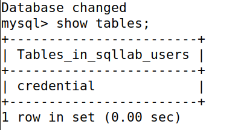

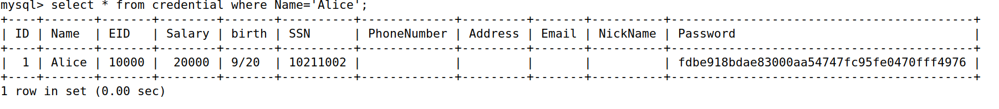

## Task 2: SQL Injection Attack on SELECT Statement
### Task 2.1 - SQL Injection Attack from webpage
<p>
Nesta tarefa é nos pedido que entremos no sistema como um utilizador Admin. Considerando que sabemos que o Username de um Admin é 'Admin', basta completar as credenciais da seguinte forma:
</p>

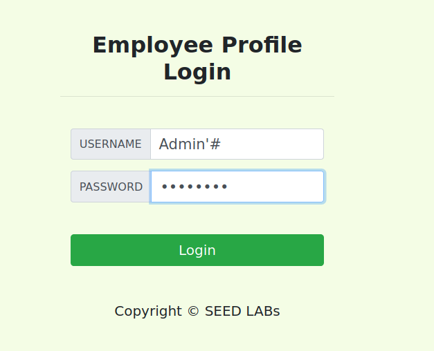

<p>
Neste caso, só preenchemos o campo da password, pois surge um alerta caso este campo esteja vazio. Portanto preenchemos este com qualquer tipo de caracter. Além disso, utilizou se o caracter '#' após 'Admin' para que tudo o que venha depois de 'Admin' seja comentado, o que seria a password neste caso. Assim, é possível entrar no sistema como Admin.
</p>

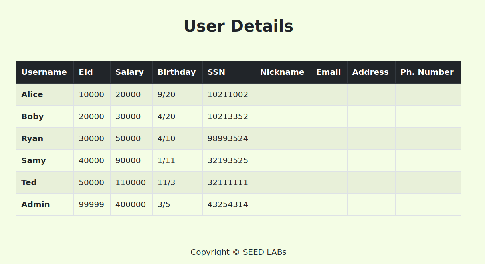

### Task 2.2 - SQL Injection Attack from command line
<p>
Como no guião nos dizia para utilizar o comando 'curl' para fazer o pedido e que certos caracteres especiais, como o 'single quote', o espaço e o '#' devem ser codificados, então utilizamos o seguinte comando:
</p>

```bash
curl 'www.seed-server.com/unsafe_home.php?username=Admin%27%23&Password=randomcharacters'
```

<p>
Como sabiamos que bastava inserir as mesmas credenciais utilizadas na task anterior, então bastava inserir essas mas na linha de comando. Assim, de forma a colocarmos que o username = Admin'#, bastava saber que o 'single quote' é codificado como %27 e o '#' como %23 e colocar uma password qualquer. Desta forma, ao executar o comando, conseguimos entrar no sistema como Admin: 
</p>

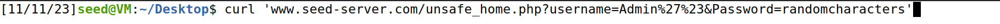

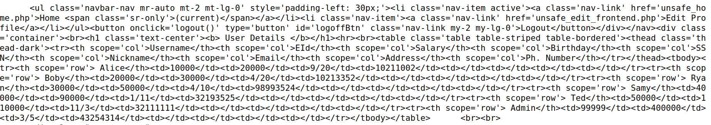

<p> Como se pode observar, o resultado é o mesmo que o obtido na task anterior, mas ao executar o comando na linha decomando as informaçoes aparecem em syntax tabular de HTML </p>

### Task 2.3 - Append a new SQL statement

<p>
Como nos informaram que para separar dois comandos SQL é necessário utilizar o caracter ';', então decidimos colocar o seguinte comando, nas credenciais do username, de forma a testar a alteração de um valor na tabela:

Admin'UPDATE credential SET Name = 'Test' WHERE Name = 'Alice'; #
</p>

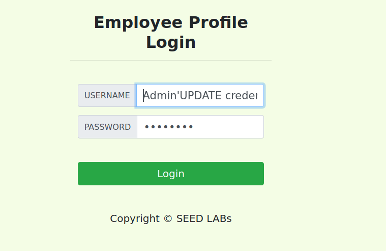

<p>
Ao clicar em 'Login', o sistema não nos deixa entrar, aparecendo a seguinte mensagem:
</p>

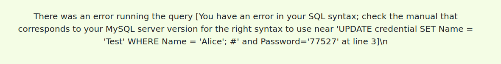

<p>
Com isto, decidimos então verificar se ao utilizar um comando que apague uma linha da tabela, o sistema também não nos deixaria entrar. Assim, colocamos o seguinte comando nas credenciais do username:

Admin'DELETE FROM credential WHERE Name = 'Alice'; #
</p>

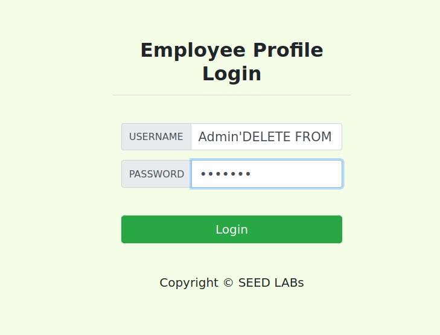

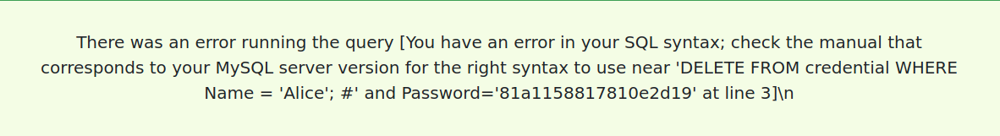

<p>
Como se pode observar, o sistema também nos envia a mesma mensagem de erro. Portanto, fomos pesquisar qual seria a medida de segurança que o sistema utiliza para evitar este tipo de ataques.
</p>

<p>
Após alguma pesquisa, verificamos que de forma a ser possível executar vários comandos SQL numa linha, é necessário que o sistema utilize a função mysqli::multi_query(). Assim, considerando que ao executarmos vários comandos SQL na mesma linha e o sistema enviar a mensagem de erro, então o sistema não utiliza esta função, o que previne este tipo de ataques.
</p>

## Task 3: SQL Injection Attack on UPDATE Statement
### Task 3.1 -  Modify your own salary

<p>
Para esta tarefa, foi nos pedido que alterassemos o salário do utilizador 'Alice'. Para tal, entramos na conta da Alice, e entramos na página 'Edit Profile', na qual nos é apresentado o seguinte formulário:
</p>

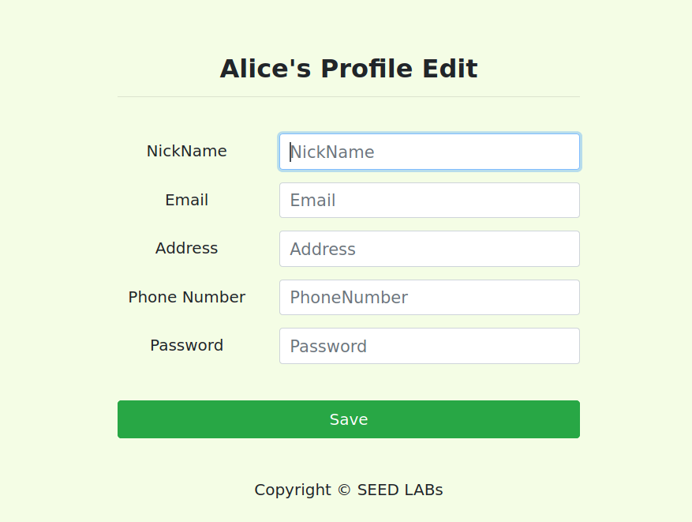

<p>
Com isto, decidimos alterar as seguintes informações:

253',salary = 999999 WHERE name='Alice'#

Colocamos o comando SQL no campo do número de telefone, mas podiamos ter colocado em qualquer outro campo exceto o da password pois esse é o unico campo em que o input é hasheado.
</p>

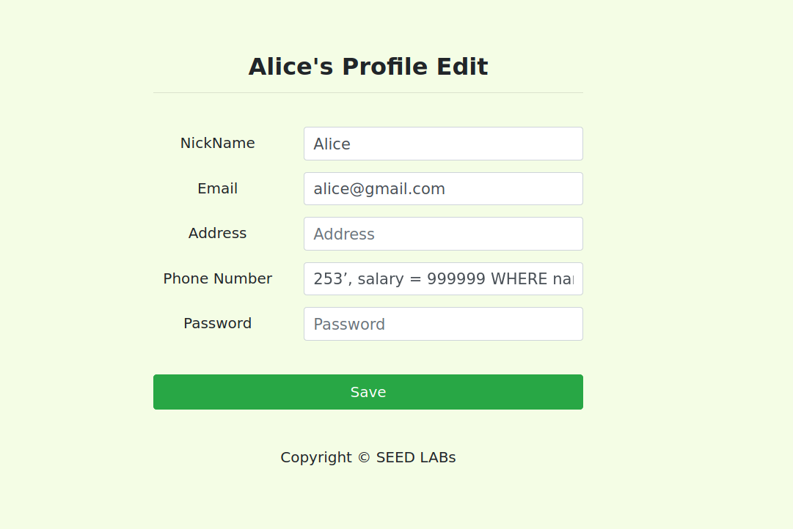

<p>
Ao clicar em 'save' podemos verificar que de facto o salário da Alice foi alterado:
</p>

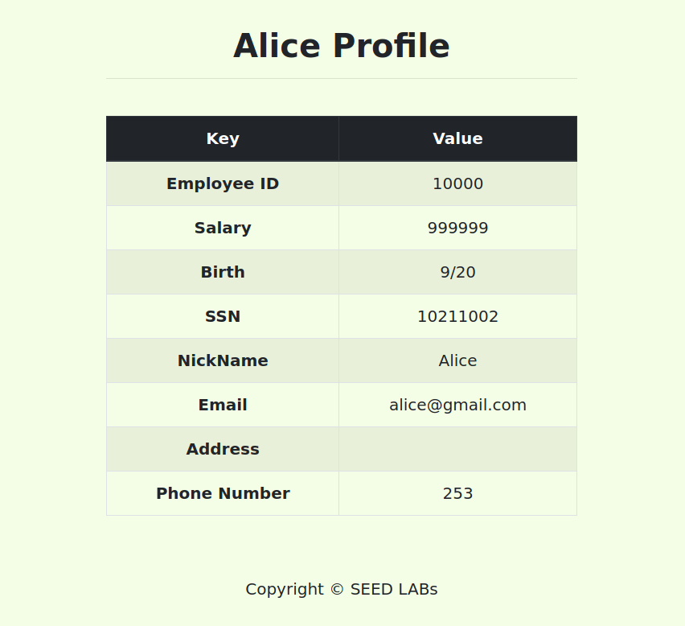

### Task 3.2 - Modify other people’ salary

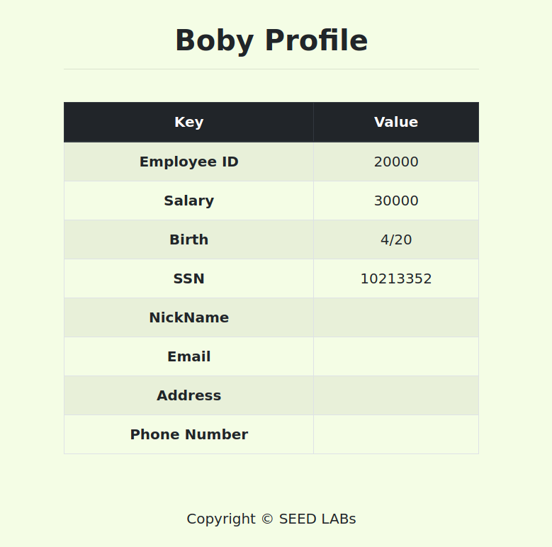

<p>
Da mesma forma que conseguimos alterar o salário da Alice, também conseguimos alterar o salário de outros utilizadores, neste caso do Boby. Para isso basta alterar um dos campos no formulário de edição de perfil, colocando o comando SQL. Neste caso colocamos no Nickname o seguinte comando:

Alice',salary = 1 WHERE name='Boby'#
</p>

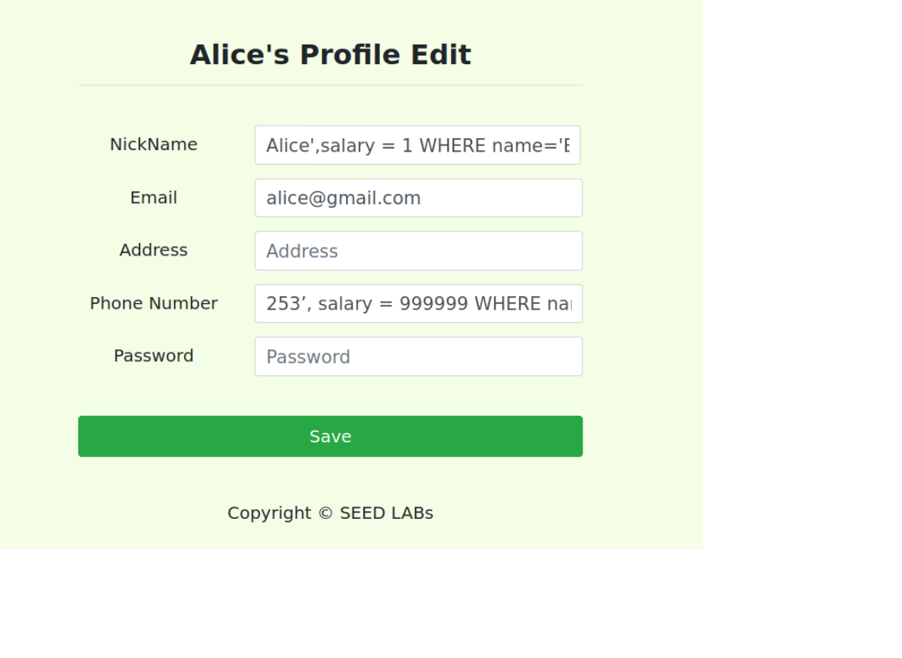

<p>
Ao clicar em 'save' podemos verificar que de facto o salário do Boby foi alterado:
</p>

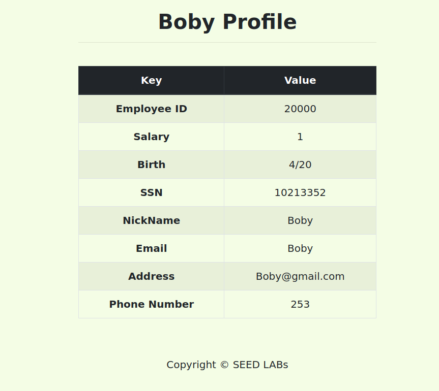

### Task 3.3 - Modify other people’ password

<p>
De forma a testarmos se conseguimos entrar na conta do Boby com a password alterada, entramos no perfil deste e alteramos a password para 'imboby':
<p>

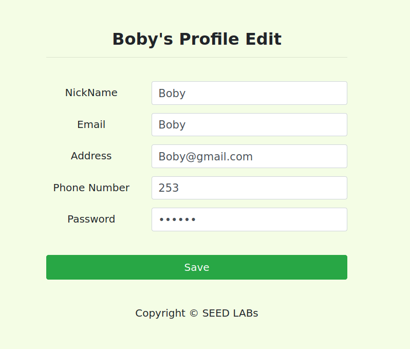

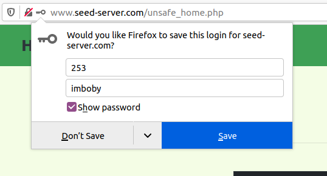

<p>
Após isso, entramos na conta da Alice e como nos dizem que o método de hash da password é o SHA1, de forma a alterar a password de um utilizador que nao a Alice, bastou utilizar o seguinte comando, tal como foi feito nas tasks anteriores:

Alice',Password = sha1('notboby') WHERE name='Boby'#
</p>

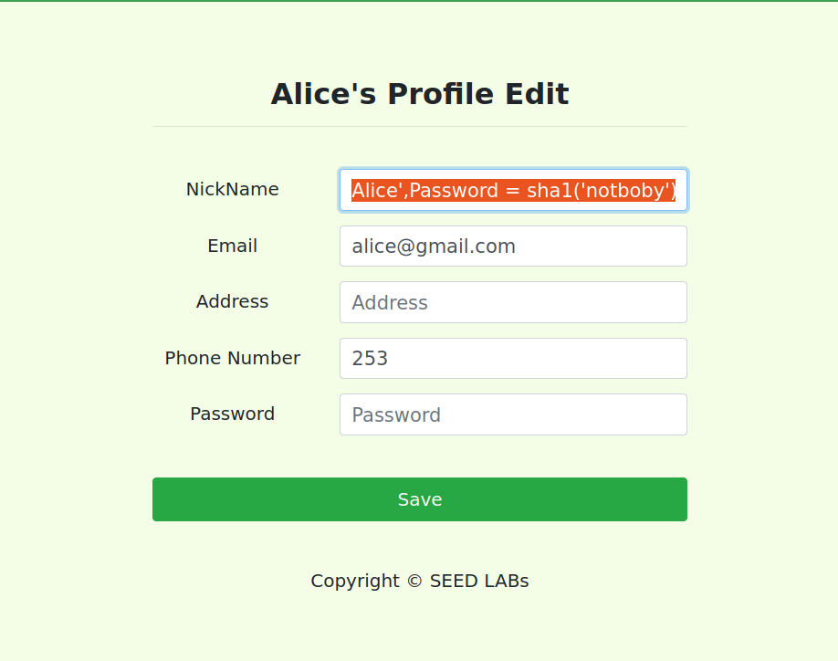

<p>
Após clicar em 'save', e dando logout, podemos verificar que ao tentar entrar com a password antiga do bob, 'imboby', não conseguimos entrar, mas ao colocar a nova password, 'notboby', conseguimos entrar na conta do Boby:
</p>

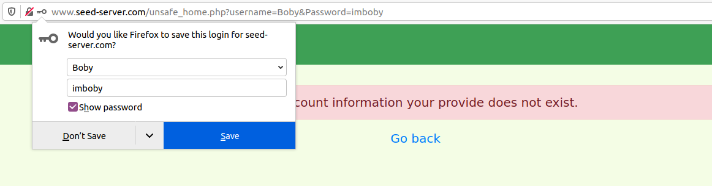

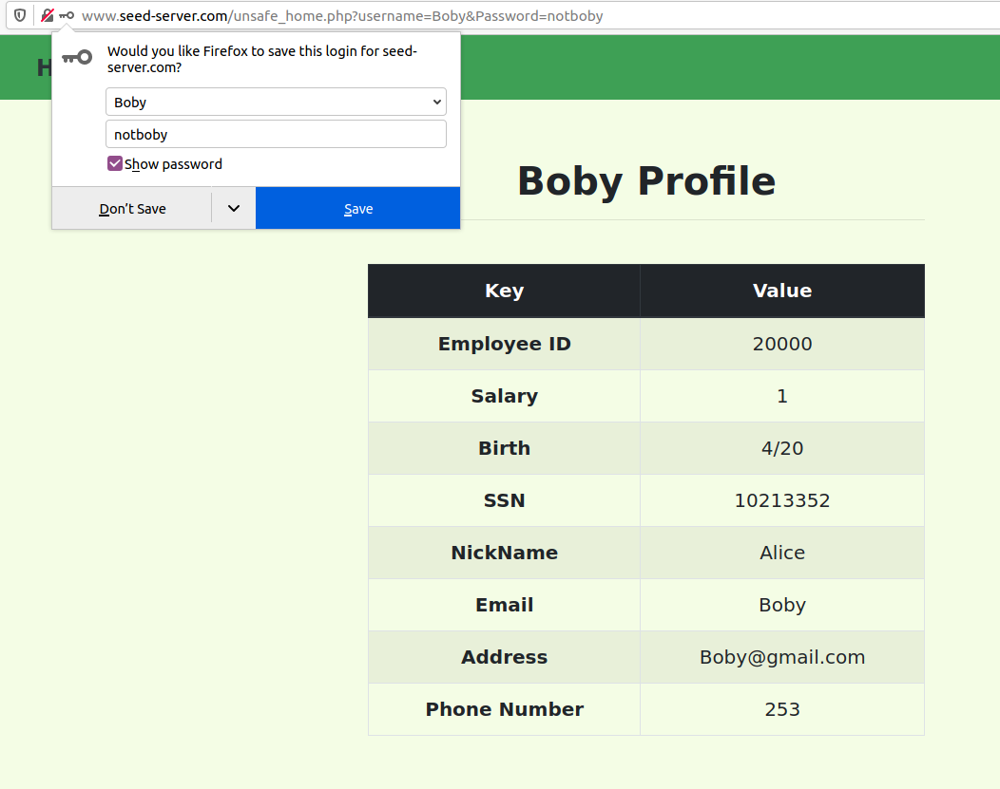
</div>

# LOGBOOK8 - CTF
<div <div align="justify">

>Que query SQL é executada para cada tentativa de login?

```php
$query = "SELECT username FROM user WHERE username = '".$username."' AND password = '".$password."'";
```

>Que input podes manipular para usurpar a query? Que caracteres especiais utilizaste e porquê?

<p>
O input que podemos manipular é o username. Os caracteres especiais que utilizamos foram o 'single quote' e o '--'. O 'single quote' foi utilizado para fechar a query e o '--' para comentar o resto da query. Isto faria com que a verificaçao da password fosse ignorada.</p>

>Qual query SQL é efetivamente executada com a tua tentativa de login maliciosa? Porque é que essa query te permite fazer login?

```sql
SELECT username FROM user WHERE username = 'admin'--' AND password = 'qualquer_caracter'
```

<p>
Esta query permite que consigamos fazer login porque o -- comenta o restante da query SQL, efetivamente ignorando a verificação da password. Portanto, se admin for um username válido, somos autentiticados como admin.
</p>

<p>
Além disso, de forma a que nao seja emitido nenhum erro por falta de password, basta colocar qualquer caracter no campo da password:
</p>

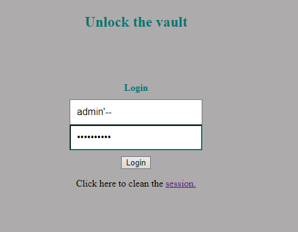

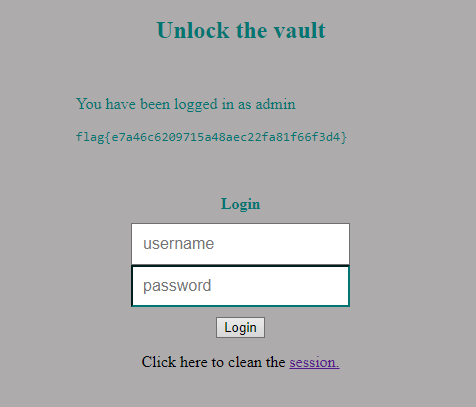

</div>
