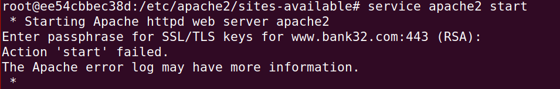

# LOGBOOK11 - PKI
## Task 1 - Becoming a certificate authority
<div <div align="justify">
<p>
Para esta tarefa é nos pedido para criarmos um self-signed certificate para nos podermos tornar numa CA:
</p>

<p>
Para isso começámos por copiar o openssl.conf que estava em /usr/lib/ssl/openssl.cnf. Alterando-o para permitir a criação de certificados com o mesmo tema, adicionalmente também criamos o serial com unicamente o número 1000 escrito e o index.txt que é deixado vazio
</p>

```bash
touch index.txt
echo "1000" >> serial
```

<p>
Criamos o nosso CA usando este comando:
</p>

```bash
openssl req -x509 -newkey rsa:4096 -sha256 -days 3650 \
-keyout ca.key -out ca.crt
```

<p>
e foram dados estes com parametros comforme prompted:
    - passphrase (dees)
    - nome do país (PT)
    - região (Porto)
    - cidade (Porto)
    - organização (UP)
    - secção (FEUP)
    - nome (L11G06)
    - email (blank)
</p>

<p>
Por fim, usamos estes comandos para conseguirmos decriptar e ler o certificado e a key:
</p>

```bash
openssl x509 -in ca.crt -text -noout
openssl rsa -in ca.key -text -noout
```

<p>
Usando a informação presente nos ficheiros respondemos às seguintes perguntas:
</p>

<p>
• What part of the certificate indicates this is a CA’s certificate?
O valor de CA está a TRUE logo podemos assegurarnos que o ficheiro trata se de um CA's certificate.
</p>


<p>
• What part of the certificate indicates this is a self-signed certificate?
O campo issuer e o campo subject são exatamente iguais.
</p>


<p>
• In the RSA algorithm, we have a public exponent e, a private exponent d, a modulus n, and two secret
numbers p and q, such that n = pq. Please identify the values for these elements in your certificate
and key files.
</p>

<p>
public exponent:
</p>


<p>
private exponent:
</p>


<p>
modulus:
</p>


<p>
secret number p:
</p>


<p>
secret number q::
</p>


<p>
n (p*q):
</p>


## Task 2: Generating a Certificate Request for Your Web Server

Usando o seguinte comando criamos ocertificado para o nosso site ficticio, neste caso, `www.bank32.com`

```bash
openssl req -newkey rsa:2048 -sha256 \
-keyout server.key -out server.csr \
-subj "/CN=www.bank32.com/O=Bank32 Inc./C=US" \
-passout pass:dees \
-addext "subjectAltName = DNS:www.bank32.com,DNS:www.bank32A.com,DNS:www.bank32B.com"
```
<p>
Obtendo assim o ficheiro RSA e o certificado do nosso site.
</p>

## Task 3: Generating a Certificate for your server

<p>
Usando o comando nano descomentamos a linha "# Extension copying option: use with caution.
copy_extensions = copy"
do ficheiro openssl.cnf que nós copiamos.
</p>

<p>
De seguida, geramos um certificado para o nosso servidor e todos os seus nomes alternativos:
</p>

```bash
openssl ca -config myCA_openssl.cnf -policy policy_anything \
-md sha256 -days 3650 \
-in server.csr -out server.crt -batch \
-cert ca.crt -keyfile ca.key
```

<p>
Ao correr o seguinte comando são gerados 2 ficheiros o server.crt e server.csr.
</p>

## Task 4 - Deploying Certificate in an Apache-Based HTTPS Website

for this task we started by setting up the `bank32_apache_ssl.conf` with the following parameters, changing the certificate and key file to the ones we have created:


<p>
Iniciamos então o servidor:
</p>

```bash
service apache2 start
```

<p>
e abrimos o site:
</p>


<p>
como podemos ver o site é considerado inseguro, adicionamos então o nosso certificado CA à lista de autoridades do Firefox, em about:preferences#privacy -> Certificates -> View Certificates -> Authorities -> Import, depois de fazermos isso podemos ver que o nosso site passou a ser assinado pelo nosso self-signed certificate:
</p>


## Task 5 - Task 5: Launching a Man-In-The-Middle Attack
### Step 1/2 - Setting up the malicious website and becoming the man in the middle

Começámos por alterar o `bank32_apache_ssl.conf` para ele passar a incluir o `example.com` e adicionamos a linha `10.9.0.80 www.example.com`
ao nosso ficheiro `etc/hosts` para emularmos o resultado de um cache poisoning attack.


### Step 3 - Browse the target website

Voltamos a iniciar o nosso servidor e podemos de seguida ver o site `example.com`:


Como o site foi criado sem nenhuma alteração ao certificado de server que tinhamos usado anteriormente, o site `example.com` é considerado inseguro pois ele não faz parte do certificado.

## Task 6 -  Launching a Man-In-The-Middle Attack with a Compromised CA

Infelizmente não conseguimos realizar a task 6, o nosso raciocinio foi repetir os passos realizados na task 2 incluindo o site `example.com` aos sites abrangidos pelo certificado.

Mas ao adicionarmos os ficheiros ao `bank32_apache_ssl.conf` e tentarmos iniciar o servidor, surge-nos este erro:




# LOGBOOK11 - CTF

<p>
Esta semana, a tarefa pedida era desincriptar a flag usando a criptografia RSA. Ao executar o comando nc ctf-fsi.fe.up.pt 6004, recebemos o valor de n para o 'cyphertext', bem como o 'public expoent' e. Também sabiamos que os valores de p e q estavam em torno de 2^512 e 2^513, respetivamente, o que torna um ataque de 'brute force' viável.

O processo escolhido passou por criar duas listas de números primos próximos a p e q dentro de uma certa distância delta das suas respetivas potências de base 2. Em seguida, calculamos o valor de d usado na fórmula de criptografia RSA ed % (p-1)(q-1) = 1, calculando o inverso modular usando o 'extended algorithm' do maior divisor comum. Por fim, usamos a função dec com algumas alterações para testar todos os valores calculados até que o texto seja legível e comece com "flag".

Assim, desenvolvemos o seguinte código:

>testPrime(n)
```python
def testPrime(n):
    if n == 2 or n == 3:
        return True

    if n <= 1 or n % 2 == 0:
        return False

    r, d = 0, n - 1
    while d % 2 == 0:
        r += 1
        d //= 2

    for _ in range(5):
        a = random.randrange(2, n - 1)
        x = pow(a, d, n)
        if x == 1 or x == n - 1:
            continue
        for _ in range(r - 1):
            x = pow(x, 2, n)
            if x == n - 1:
                break
        else:
            return False
    return True
```

>findDelta(e,p,q) 
```python
def extended_gcd(a, b):
    if a == 0:
        return b, 0, 1
    else:
        g, x, y = extended_gcd(b % a, a)
        return g, y - (b // a) * x, x

def modinv(a, m):
    g, x, y = extended_gcd(a, m)
    if g != 1:
        return None
    else:
        return x % m

def findDelta(e, p ,q):
   return modinv(e, (p-1)*(q-1))
```
>dec(msg, d, n)
```python
def dec(msg, d, n):
    int_msg = int.from_bytes(unhexlify(msg), "little")
    res = pow(int_msg,d,n)
    return res.to_bytes(256, 'little')
```

>main
```python
list_of_p_primes= []
for i in range(2**512 - 10000, 2**512 + 10000):
    if testPrime(i):
        list_of_p_primes.append(i)

list_of_q_primes= []
for i in range(2**513 - 10000, 2**513 + 10000):
    if testPrime(i):
        list_of_q_primes.append(i)

for p in list_of_p_primes:
    for q in list_of_q_primes:
        if p * q == n:
            print("p: ", p)
            print("q: ", q)
            d = findD(65537, p, q)
            res = dec(unhexlify(msg), d, n)
            if res[:4] == b"flag":
                print(res)
                exit()
```

>n
```python
n = 359538626972463181545861038157804946723595395788461314546860162315465351611001926265416954644815072042240227759742786715317579537628833244985694861279004092275563997766650696366721966551613139797548933222588230171089402511870182086106206027533519627103030004058519310881700376798871190073497608807358790595259
```

>e
```python
e = 65537
```

>msg
```python
msg = 3331346664313538626635613865396632633038626665313434383065613036323839633337356265323763323061616134653637393131396536303836363838623631623165663639616538616365303161653662646164343636636138396234353130333431316633376334656134643636353236613663386333633730343937323030386434643430326166313332663861316134333833633865316135626638663337386239306364306637356434666631366633346362656531343032343135376237336434373136333161633462363562636632656139313066613534653335656365363661306664663761336530373636326233636431373230313030303030303030303030303030303030303030303030303030303030303030303030303030303030303030303030303030303030303030303030303030303030303030303030303030303030303030303030303030303030303030303030303030303030303030303030303030303030303030303030303030303030303030303030303030303030303030303030303030303030303030303030303030303030303030303030303030303030303030303030303030303030303030303030303030303030303030303030303030303030303030303030303030303030303030303030303030303030303030303030303030303030303030303030303030
```


