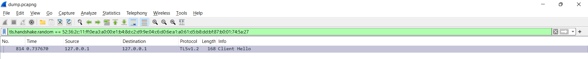
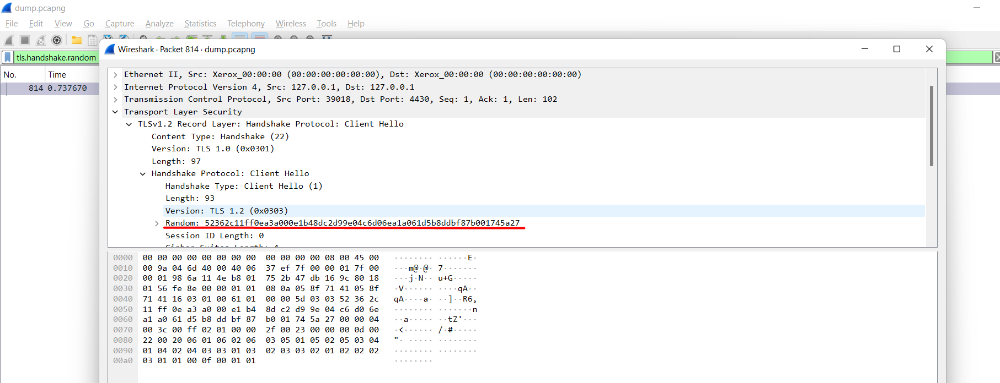
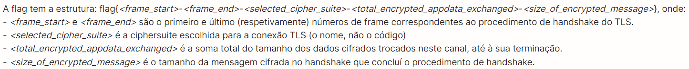
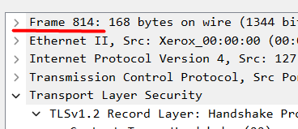
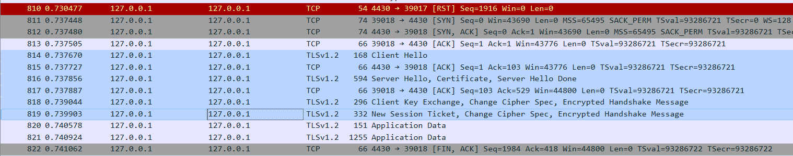
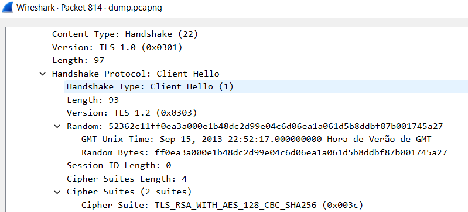
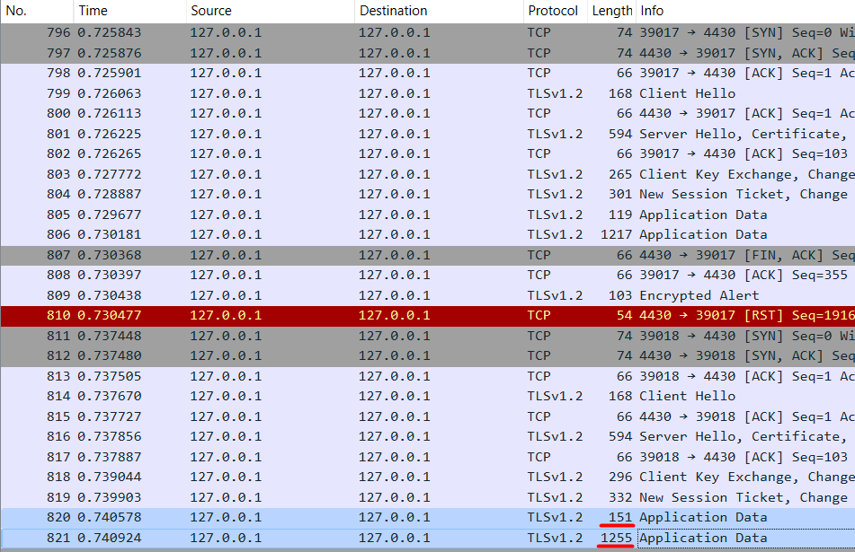
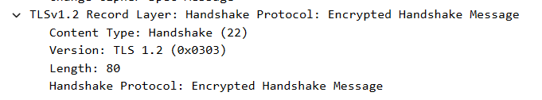

# LOGBOOK11 - Sniffing and Spoofing
## Task 1 - Becoming a certificate authority

# LOGBOOK11 - CTF

 Para o CTF desta semana, foi nos pedido que analisássemos um ficheiro .pcapng, que continha uma captura de tráfego de rede e que obtivéssemos a flag. 

 Para isso tivemos inicialmente que encontrar o handshake com a mensagem aleatória igual 52362c11ff0ea3a000e1b48dc2d99e04c6d06ea1a061d5b8ddbf87b001745a27. Para isso, abrimos o ficheiro no Wireshark e utilizando o filtro 'tls.handshake.random == 52:36:2c:11:ff:0e:a3:a0:00:e1:b4:8d:c2:d9:9e:04:c6:d0:6e:a1:a0:61:d5:b8:dd:bf:87:b0:01:74:5a:27', encontramos a mensagem desejada

 Obtendo assim o handshake desejado, podemos agora analisa-lo de forma a descobrir os seguintes parâmetros para conseguirmos obter a flag:

>Frame_start

 Considerando que o handshake é sempre o frame inicial conseguimos então dizer que o frame_start = 814 

>Frame_end

 Removendo o filtro e procurando pelo frame814, conseguimos obter todas as mensagens trocadas durante o handshake, conseguindo então perceber que o frame_end é referente ao frame com a mensagem New Session Ticket, Change Cipher Spec, Encrypted Handshake Message, que é o fram819, já que está é a mensagem enviada no término do handshake. 

>Selected_cipher_suite

 Analisando o frame com a mensagem de hello, somos capazes de verificar o nome do cipher suite e verificamos que é 'TLS_RSA_WITH_AES_128_CBC_SHA256' 

>Total_encrypted_appdata_exchanged

 De forma a obtermos este valor, tivemos que analisar o frame logo a seguir à realização do handshake -> frame820. Isto permitiu nos então descobrir que o valor do total_encrypted_appdata_exchanged = 1264 

>Size_of_encrypted_message

 Para obtermos este valor tivemos que analisar o frame819 outra vez e conseguimos chegar a conclusão que o valor deste parametro = 80 

 Assim foi nos possível obter a seguinte flag: flag{814-819-TLS_RSA_WITH_AES_128_CBC_SHA256-1264-80} 

