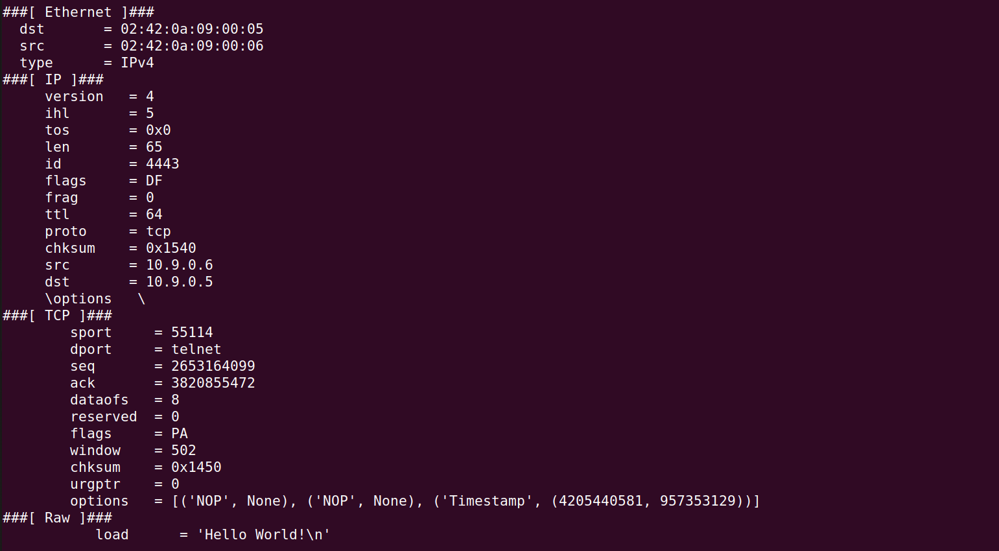

# LOGBOOK13 - Sniffing and Spoofing
##  Task 1.1 - Sniffing Packets
<div <div align="justify">
<p>Our First task consisted in sniffing packet on the interface associated to the ip address of our VM, which is 10.9.0.1. To do so we needed to run ifconfig and search for the IP address:</p>


<p>After finding it we altered the code given in the Seed-Labs guide, changing the interface to br-908e0ec6c682.</p>

````python
#!/usr/bin/env python3
from scapy.all import *

def print_pkt(pkt):
    pkt.show()

pkt = sniff(iface='br-908e0ec6c682', filter='icmp', prn=print_pkt)
````

### Task 1.1A

<p>We then made the program executable:

```bash
chmod a+x sniffer.py
```

<p>And executed it, first with root privilege, pinging hostB from HostA.</p>

<p>We can see ICMP echo-requests being sent from A to B</p>


<p>And ICMP echo-replys being sent from B to A.</p>


<p>We then tried to execute it without root privilege, but permission was denied directly after running the program.</p>


### Task 1.1B

<p>For this part of the task we wanted to filter the packet that our program caught.</p>

**Capture only the ICMP packet**

<p>First we were asked to filter only icmp packets, we has almost nothing to change in our code because the code given to us in the guide already had the icmp filter in place. We just created a variable to keep the filter</p>

```python
filter_icmp = 'icmp'
pkt = sniff(iface='br-908e0ec6c682', filter=filter_icmp, prn=print_pkt)
```

<p>We then repeated what we had done before and pinged hostB from hostA and without much surprise saw the same messages we add caught before</p>


**Capture any TCP packet that comes from a particular IP and with a destination port number 23**

<p>For the second filter, we created the following variable:</p>

```python
filter_tcp ='tcp and src host 10.9.0.6 and dst port 23'
```

<p>Making it so our program caught every tcp packet sent from hostB, which has the IP address 10.9.0.6, and destination port 23</p>

<p>Our final program looked like this</p>

```python
filter_icmp = 'icmp'
filter_tcp = 'tcp and src host 10.9.0.6 and dst port 23'

pkt = sniff(iface='br-908e0ec6c682', filter=filtertcp, prn=print_pkt)
```

<p>To test it we sent 'Hello World!' form hostB to port 23</p>

```bash
echo "Hello World!" > /dev/tcp/10.9.0.5/23
```



**Capture packets comes from or to go to a particular subnet. You can pick any subnet, such as 128.230.0.0/16; you should not pick the subnet that your VM is attached to.**

<p>For this third and last filter we chose the subnet 128.230.0.0/16, which was given in the guide, and created our filter:</p>

```python
filter_net = 'net 128.230.0.0/16'
```

<p>And added it to our list of already existing filters.</p>

```python
filter_icmp = 'icmp'
filter_tcp = 'tcp and src host 10.9.0.6 and dst port 23'
filter_net = 'net 128.230.0.0/16'

pkt = sniff(iface='br-908e0ec6c682', filter=filter_net, prn=print_pkt)
```

<p>To test this filter we pinged 2 random addresses that belonged to the subnet, 128.230.0.1 and 128.230.1.3</p>

<p>128.230.0.1:</p>


<p>128.230.1.3:</p>


<p> As we can see, our program caught both requests.</p>

## Task 1.2: Spoofing ICMP Packets

<p>For this task our objective was to spoof an echo-request packet and see if the targeted ip would send an echo-reply as answer. For that we took the code given in the guide and changed the ip to 10.9.0.5 which is the ip of hostA, that way we were sure that the ip we were using is assigned and any error that showed up could only originate from our code.</p>

<p>Our code looked like this:</p>

```python
#!/usr/bin/env python3
from scapy.all import *

a = IP()
a.dst = '10.9.0.5' 
b = ICMP() 
p = a/b 
send(p) 
```

<p>We then made the program executable and ran it with wireshark open to observe any packet that passed through the interface.</p>

<p>And this is what we observed:</p>


<p>As we can see a ICMP echo-request packet has been sent and a echo-reply was sent back by hostA, proving that our spoofing is working</p>

## Task 1.3 - Traceroute

<p>For this task our objective was to discover how many routers our packet has to go through before reaching its destination. For that purpose we used the ttl(Time to live) of a packet, which states how many routers the packet can go through before 'dying'.</p>

<p>For that purpose we devised the following program:</p>

```python
#!/usr/bin/env python3
from scapy.all import *

a = IP()
a.dst = '8.8.8.8'
ttl = 1

while True:
    a.ttl = ttl
    b = ICMP()
    response = sr1(a/b, timeout=1, verbose=0)

    if response is not None:
        if response.src == a.dst:
            print(f"Destination reached. Exiting. Final TTL: {ttl}")
            exit()
        print(f"TTL: {ttl}, IP Address: {response.src}")
        ttl += 1
    else:
        print(f"TTL: {ttl}, No response")
        ttl += 1
```

<p>We defined our destination has 8.8.8.8 which if put in a browser takes us to a google page</p>
<p>Our code is simple, it starts with a ttl of 1 if the router where it 'dies' doesn't give an answer back, or gives one but isn't the destination, it will increase the ttl until it reaches its destination</p>
<p>The output of the code was the following:</p>


## Task 1.4 - Sniffing and-then Spoofing

<p>Finally we combined the previous task into this last one, we were asked to detect echo-request sent and reply to them no matter if the target ip existed or not.</p>

<p>For this new program we started by making a filter that would only detect ICMP echo-requests, we made the following filter to serve that purpose.</p>

```python
filter_icmp = 'icmp and icmp[0] == 8'

pkt = sniff(iface='br-908e0ec6c682', filter=filter_icmp, prn=spoof_reply)
```

<p>We then had to take the information from the echo-request and adapt it to our answer, we created the spoof_reply function that took the packet we detected and handled the reply:</p>

```python
def spoof_reply(packet):
	ip = IP()
	icmp = ICMP()
	ip.dst = packet[IP].src
	ip.src = packet[IP].dst
	icmp.type = 0
	icmp.id=packet[ICMP].id
	icmp.seq=packet[ICMP].seq
	payload = packet[Raw].load
	reply = ip / icmp / payload
	send(reply)
	print(f"Source IP: {ip.src}, Destination IP: {ip.dst}, Id={icmp.id}")
```

<p>The only diference between an echo-request and its reply are its type (8 for requests and 0 for replies) and the interchanging ip addresses. We also found online, after some research that the data present in the request and the reply is exactly the same(represented by our payload).</p>

<p>Our full program looked like this:</p>

```python
#!/usr/bin/env python3
from scapy.all import *

def spoof_reply(packet):
	ip = IP()
	icmp = ICMP()
	ip.dst = packet[IP].src
	ip.src = packet[IP].dst
	icmp.type = 0
	icmp.id=packet[ICMP].id
	icmp.seq=packet[ICMP].seq
	payload = packet[Raw].load
	reply = ip / icmp / payload
	send(reply)
	print(f"Source IP: {ip.src}, Destination IP: {ip.dst}, Id={icmp.id}")

filter_icmp = 'icmp and icmp[0] == 8'

pkt = sniff(iface='br-908e0ec6c682', filter=filter_icmp, prn=spoof_reply)
```

<p>We first pinged a non-existing host on the Internet and received the expected echo-replies</p>


<p>We then tried to ping a non-existing host on the Lan but nothing happened, to get more information we used the program we had made for the task 1.1 and put an empty filter in the sniff function to see which type of packets were being sent.</p>

```python
#!/usr/bin/env python3
from scapy.all import *

def print_pkt(pkt):
    pkt.show()

filter_icmp = 'icmp'
filter_tcp = 'tcp and src host 10.9.0.6 and dst port 23'
filter_net = 'net 128.230.0.0/16'

pkt = sniff(iface='br-908e0ec6c682', filter='', prn=print_pkt)
```


<p>As we can see ARP packets are being sent, after some research we concluded that since we are trying to ping inside our LAN ARP packets are being sent trying to map a MAC address to the ip provided. Since the ip doesn't exist the system can't resolve the ARP packets and consequently doesn't send the echo-request packets. Making it so that when trying to ping inside a LAN the ICMP echo-request packets are only sent after mapping the ip to a MAC address ARP packets making our sniff and-then spoof program unusable inside the LAN</p>

<p>Finally we pinged 8.8.8.8, which our program caught but since the ip exists and is accessible by our network we received duplicated echo-replies</p>


# LOGBOOK13 - Cdifferenceara o CTF desta semana, foi nos pedido que analisássemos um ficheiro .pcapng, que contdifferencecaptura de tráfego de rede e que obtivéssemos a flag. </p>
<p> Para isso tivemos inicialmente que encontrar o handshake com a mensagem aleatória igual 52362c11ff0ea3a000e1b48dc2d99e04c6d06ea1a061d5b8ddbf87b001745a27. Para isso, abrimos o ficheiro no Wireshark e utilizando o filtro 'tls.handshake.random == 52:36:2c:11:ff:0e:a3:a0:00:e1:b4:8d:c2:d9:9e:04:c6:d0:6e:a1:a0:61:d5:b8:dd:bf:87:b0:01:74:5a:27', encontramos a mensagem desejada</p>


<p> Obtendo assim o handshake desejado, podemos agora analisa-lo de forma a descobrir os seguintes parâmetros para conseguirmos obter a flag:</p>


>Frame_start

<p> Considerando que o handshake é sempre o frame inicial conseguimos então dizer que o frame_start = 814 </p>


>Frame_end

<p> Removendo o filtro e procurando pelo frame814, conseguimos obter todas as mensagens trocadas durante o handshake, conseguindo então perceber que o frame_end é referente ao frame com a mensagem New Session Ticket, Change Cipher Spec, Encrypted Handshake Message, que é o fram819, já que está é a mensagem enviada no término do handshake. 
</p>


>Selected_cipher_suite

<p> Analisando o frame com a mensagem de hello, somos capazes de verificar o nome do cipher suite e verificamos que é 'TLS_RSA_WITH_AES_128_CBC_SHA256' </p>


>Total_encrypted_appdata_exchanged

<p> De forma a obtermos este valor, tivemos que analisar o frame logo a seguir à realização do handshake -> frame820. Isto permitiu nos então descobrir que o valor do total_encrypted_appdata_exchanged = 1264 </p>


>Size_of_encrypted_message

<p> Para obtermos este valor tivemos que analisar o frame819 outra vez e conseguimos chegar a conclusão que o valor deste parametro = 80 </p>


<p> Assim foi nos possível obter a seguinte flag: flag{814-819-TLS_RSA_WITH_AES_128_CBC_SHA256-1264-80} </p>


